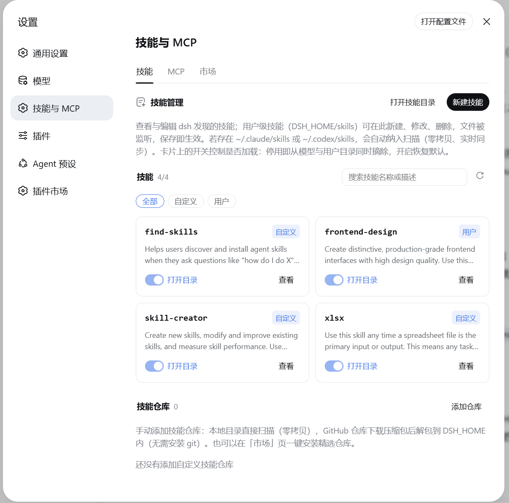
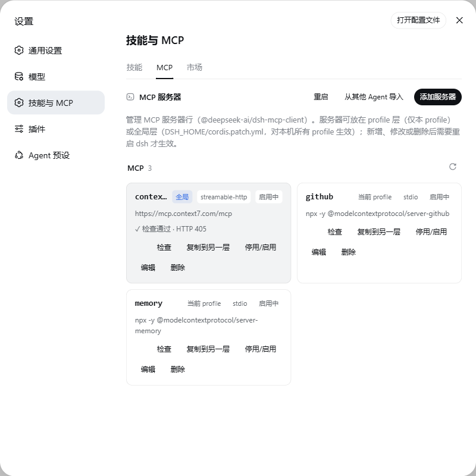

# dsh-plugin-capabilities

[](https://www.npmjs.com/package/dsh-plugin-capabilities)
[](./LICENSE)

在 dsh 设置页管理技能与 MCP 服务器。本插件在插件区新增「技能」「MCP」两个标签页，技能目录和 profile 的 MCP 服务器行都能直接在页面上查看与维护，不必手工编辑文件；来自 Claude Code、Codex 等其他 agent 的技能与 MCP 配置也能一并纳入。`dsh web` 与 [DSH Desktop](https://github.com/qinyre/dsh-Desktop) 均可使用。

## 技能



「技能」页列出 dsh 当前发现的全部技能，包括名称、描述、来源（项目、用户、内置、运行时、自定义）和调用策略。用户级技能存放在 `$DSH_HOME/skills`，可以在这里新建、编辑、删除：frontmatter 与正文分开填写，保存后写入对应的 `SKILL.md`。技能目录处于文件系统监听之下，保存后数秒内条目就会出现在列表里，无需重启。项目目录和内置包等来源的技能以只读方式展示，可以查看全文。

如果机器上存在 Claude Code 或 Codex 的技能目录（`~/.claude/skills`、`~/.codex/skills`），它们会作为额外的扫描根自动进入目录。文件不会被复制，改动留在原地，两边实时同步。

## MCP



「MCP」页管理 profile patch 中的 MCP 服务器行，每行对应一个 `@deepseek-ai/dsh-mcp-client` 实例。stdio 服务器填写命令与参数，streamable-http 服务器填写 URL，编辑、停用、移除都在页面上完成。YAML 读写采用文档级 API，文件中的其他行与注释不受影响。

也可以从其他 agent 导入：一键扫描 Claude Code（`~/.claude.json`、`~/.claude/settings.json`）与 Codex（`~/.codex/config.toml`）的 MCP 配置，勾选所需条目后转为本 profile 的服务器行。stdio 与 http 两种传输都会处理，已存在的同名服务器置灰跳过。需要注意的是，Claude 配置里的 `${VAR}` 环境变量引用按字面值导入，如有需要请在导入后手动改回。

MCP 行的变更需要重启 dsh 才会进入组合。MCP 页头部有常驻的「重启」按钮，变更后无需离开界面：在 [DSH Desktop](https://github.com/qinyre/dsh-Desktop) 中由桌面壳层重启受监督的 sidecar，完成后窗口自动重载；直接运行 `dsh web` 时插件会拉起一个替代进程再退出自身，页面在恢复后自动刷新——若启动时端口是随机的，按横幅提示在终端查看新地址。重启会中断正在进行的回合，点击后会先弹出确认。

## 安装

```sh
dsh plugin --profile web add dsh-plugin-capabilities
```

安装后打开 设置 → 插件，即可看到新增的「技能」与「MCP」标签页。开发时也可以直接安装本地源码检出：`dsh plugin --profile web add file:/path/to/dsh-plugin-capabilities`，包内的 `prepare` 脚本会自动构建出 `lib/`。

## 工作原理

服务端 inject `webServer` 与 `skills`，在 web 服务器上注册 `/dsh-plugin-capabilities/*` 路由。Web 组合有意禁用了宿主平面的 `skill-filesystem` 行（会话内的技能发现归 agent preset 所有），本插件因此在宿主平面挂载自己的 filesystem provider 子插件，并把其他 agent 的技能目录作为额外扫描根传入：子插件随本插件卸载而卸载，技能注册进全局层，preset 层语义不变，设置页由此获得实时目录。写操作设有同源（CSRF）栅栏与输入校验——技能名 kebab-case 语法、MCP serverName 语法、路径穿越拒绝。

## 开发

```sh
npm install
npm run typecheck
npm test
npm run build
```

端到端 smoke 默认关闭，要求同级目录下存在 [deepseek-harness](https://github.com/deepseek-ai/deepseek-harness) 源码检出，且 Node ≥ 22.19：

```sh
DSH_DESKTOP_PLUGIN_SMOKE=1 npm test
```

它会创建临时 `DSH_HOME`，把本插件装进 `web` profile，启动 `dsh web`，验证技能写入→目录监听→列表更新的完整链路，以及 MCP 行的写入与读回。

## 许可

[MIT](./LICENSE)
