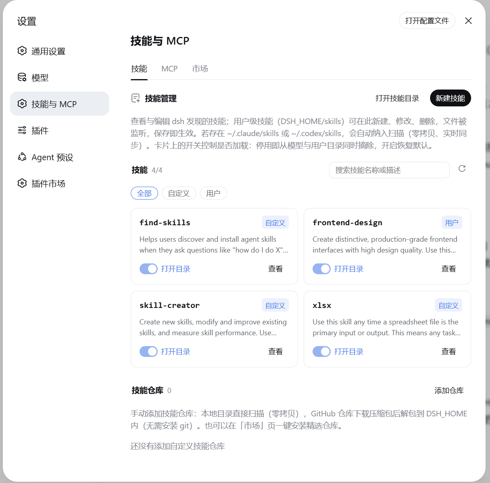
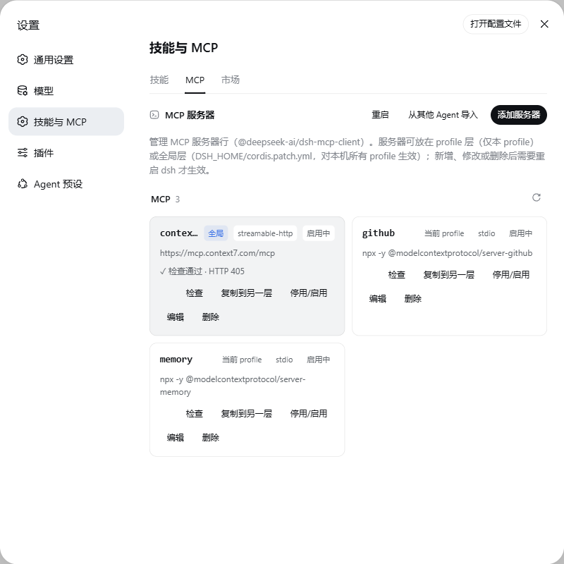
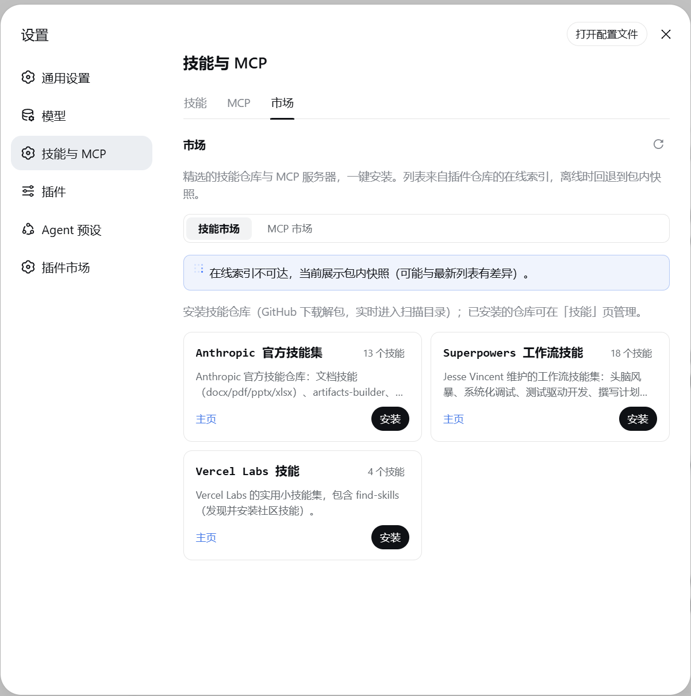
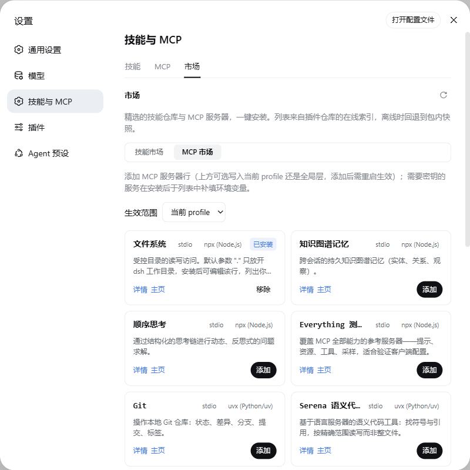

# dsh-plugin-capabilities

[](https://www.npmjs.com/package/dsh-plugin-capabilities)
[](./LICENSE)

在 dsh 设置页管理技能与 MCP 服务器。设置里新增一级分区「技能与 MCP」（与「通用设置」「模型」并列），内含「技能」「MCP」「市场」三个标签页：技能目录、自定义技能仓库和两层（profile / 全局）MCP 服务器行都能在页面上直接维护，不必手工编辑 YAML；Claude Code、Codex、Cursor、Gemini CLI 等其他 agent 的技能与 MCP 配置也能一键纳入。在 `dsh web`（含桌面端内嵌的 Web 界面）中均可使用，新旧两代运行时（0.1.1 至 0.1.7-rc.2）均实测兼容。

## 技能

<p align="center"></p>

列出 dsh 当前发现的全部技能，带名称、描述、来源与调用策略。用户级技能（`$DSH_HOME/skills`）可在页面上新建、编辑、删除，文件保存后数秒生效、无需重启；从市场或仓库安装的技能也能就地编辑，写回只替换编辑器掌握的几个键，frontmatter 其余内容（license、allowed-tools 等）原样保留。

落在磁盘上的技能都有开关：关掉即从模型目录与 `/` 命令摘除，打开恢复默认，文件其余内容一字不动。列表带搜索与来源筛选，卡片上可一键打开技能所在文件夹。若存在 `~/.claude/skills` 或 `~/.codex/skills`，会作为额外扫描根实时纳入，零拷贝、原地同步。插件还随包自带 skill-creator 与 find-skills 两条只读技能（来自 [anthropics/skills](https://github.com/anthropics/skills) 与 [vercel-labs/skills](https://github.com/vercel-labs/skills)），随插件升级与卸载。

### 技能仓库

支持两类来源：本地目录（直接扫描，删除仓库不动原文件）与 GitHub 仓库（`owner/repo`，可 `#分支` 锁定版本，经 tarball 下载解包到 `DSH_HOME`，无需安装 git）。仓库布局自动识别——单技能居根、各占子目录或集中在二级目录都能找到；增删即时生效，无需重启。

## MCP

<p align="center"></p>

管理 `@deepseek-ai/dsh-mcp-client` 服务器行，stdio 与 streamable-http 均支持，添加、编辑、停用、移除都在页面完成；YAML 走文档树读写，文件里的其他行与注释不受影响，补丁文件本身有语法错误时页面直接报出路径与行列、不写入任何内容。profile 层与全局层（`DSH_HOME/cordis.patch.yml`）合并展示，每行标记所在层、同名时注明谁生效，添加与复制可任选目标层；「检查」不启动服务器——stdio 在 PATH 里确认命令存在，http 发一个短超时 GET 即判断可达。

表单同时给出与保存结果一致的完整 YAML 行和等价的 `mcpServers` JSON 写法，直接抄去别的工具；反过来把 Claude Code 配置或任意 JSON 粘进输入框，点「解析并填充」即可自动填好。也可以从其他 agent 整体导入：一键扫描 Claude Code、Codex、Cursor、Gemini CLI 的 MCP 配置，弹窗里选写入层、勾选条目即成行（Claude 配置里的 `${VAR}` 按字面值导入，需要时导入后改回）。

MCP 变更需重启 dsh 生效，页头的「重启」按钮不必离开界面：桌面端由壳层重启 sidecar，独立 `dsh web` 由插件接力重启，页面恢复后自动刷新。

## 市场

<p align="center">
  
  
</p>

「技能市场」是精选的技能仓库（Anthropic 官方技能集、Superpowers 工作流集等），点「安装」即走上文仓库的下载解包流程，装完立即出现在「技能」页；「MCP 市场」是精选服务器列表（filesystem、memory、git 及 context7 等常用第三方），点「添加」等价于手工添加一条服务器行，写入哪一层跟随列表上方的范围选择。条目都可点开看详情：技能仓库列出内含技能清单，MCP 服务器列出启动命令、环境变量与工具清单。列表来自[本仓库](https://github.com/qinyre/dsh-plugin-capabilities)的在线索引，离线时回退包内快照；已安装条目可直接卸载。

## 安装

```sh
dsh plugin --profile web add dsh-plugin-capabilities
```

本地源码检出也可直接安装（`prepare` 自动构建）：`dsh plugin --profile web add file:/path/to/dsh-plugin-capabilities`。

## 工作原理

服务端在 web 服务器上注册 `/dsh-plugin-capabilities/*` 路由，并在宿主平面挂载自己的 filesystem provider 子插件以获得实时技能目录——其他 agent 的目录与用户注册的仓库作为额外扫描根，随插件装卸，不动 preset 层语义。GitHub 仓库由内置纯 JS tar 读取器解包，全程不 spawn 子进程；写操作带同源栅栏与输入校验（技能名、serverName 语法、路径穿越拒绝）。官方桌面壳转发而来的请求没有 Origin 头，仅当回环 Host、回环连接对端、无代理痕迹且无跨站 Sec-Fetch-Site 标记时放行。

## 开发

```sh
npm install
npm run typecheck
npm test
npm run build
```

端到端 smoke 默认关闭，要求同级目录下存在 [deepseek-harness](https://github.com/deepseek-ai/deepseek-harness) 源码检出且 Node ≥ 22.19：`DSH_DESKTOP_PLUGIN_SMOKE=1 npm test`。

## 许可

[MIT](./LICENSE)
